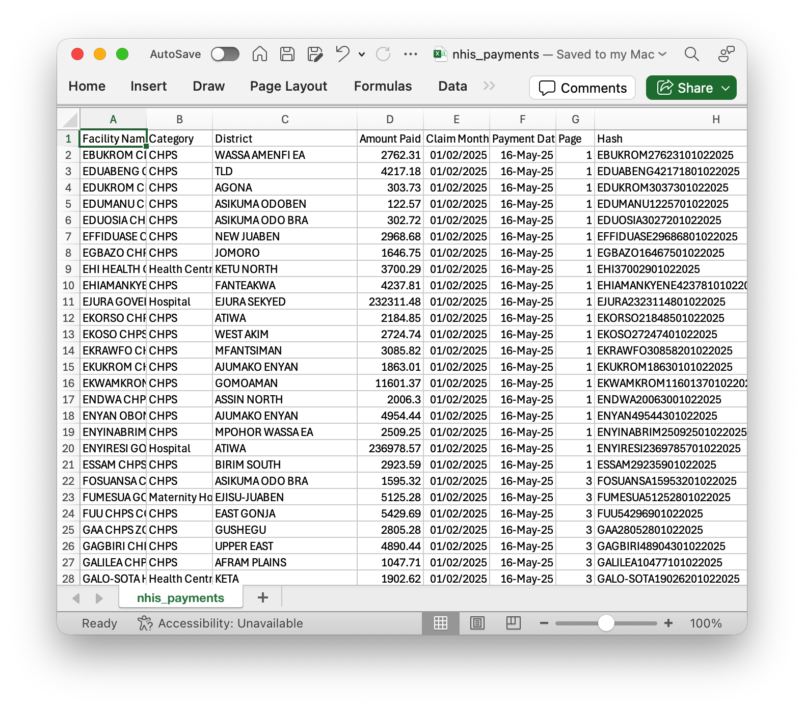
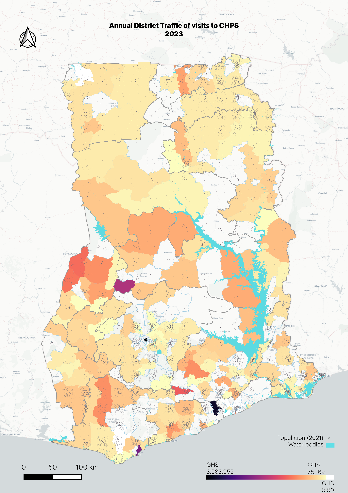
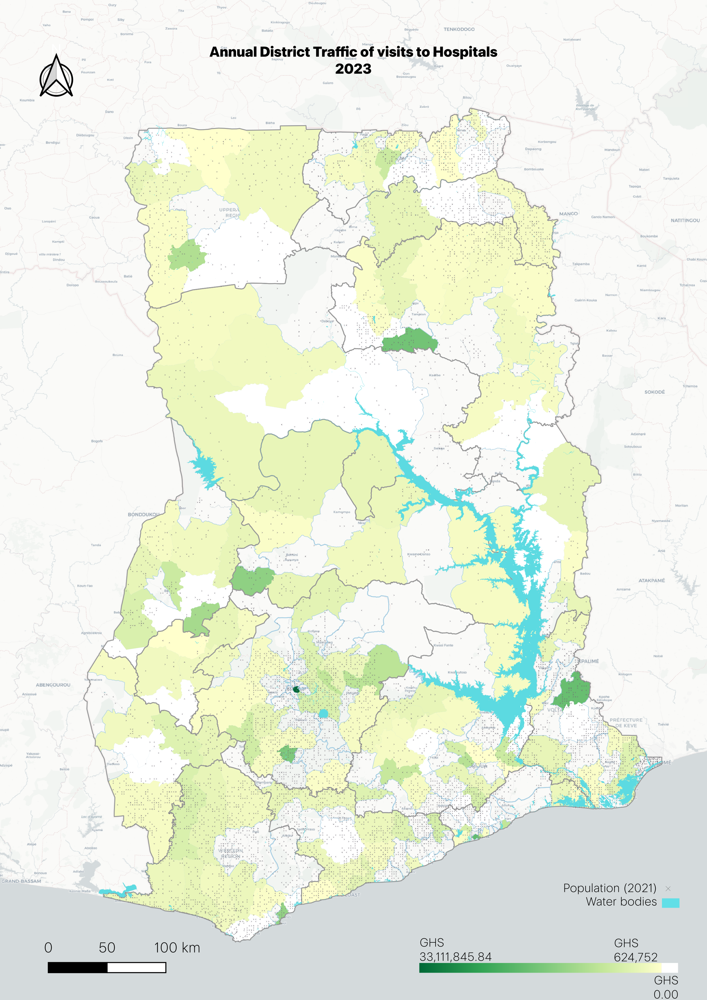

# 🏥 NHISScraper

NHISScraper is a Python tool that automates the scraping of **National Health Insurance Scheme (NHIS) Ghana** payment records from the [NHIS Payments Portal](https://www.nhis.gov.gh/payments).  
It uses **Selenium** with Safari WebDriver and **BeautifulSoup** to collect payment data, organize it into structured CSV files, and resume scraping across sessions without duplicating records.

---

## ✨ Features
- 🚀 **Automated scraping** of NHIS payment records across all pages.
- 📂 Saves results in a structured CSV file:
  - Facility Name  
  - Facility Category (auto-classified)  
  - District  
  - Amount Paid  
  - Claim Month (normalized as `DD/MM/YYYY`)  
  - Payment Date  
  - Page number  
  - Unique row hash
- 🔄 **Resumable scraping:** resumes from the last saved page automatically.
- 🛡️ **Duplicate-aware:** uses a hash to avoid saving repeated rows.
- 📝 **Logging:** detailed logs saved to `nhis_scraper.log`.
- ⏳ Configurable wait time for slow network connections.
- 🧹 Gracefully handles interruptions (e.g., Ctrl+C) by flushing in-memory data to disk.

---

## 🛠️ Requirements
- Python **3.8+**
- macOS with **Safari WebDriver** enabled
- Recommended Python packages (install via `pip`):

```bash
pip install selenium beautifulsoup4 pandas
```

> **Note:** On macOS, enable **Safari → Preferences → Advanced → Show Develop menu**, then enable **Allow Remote Automation**.

---

## 📦 Installation
Clone the repository:
```bash
git clone https://github.com/your-username/NHISScraper.git
cd NHISScraper
```

Install the dependencies:
```bash
pip install -r requirements.txt
```

*(You can create a virtual environment for cleaner dependency management.)*

---

## 🚀 Usage
Run the scraper with:
```bash
python nhis_scraper.py
```

### Parameters
You can specify:
- **`fln`** – output CSV filename (default: `nhis_payments.csv`)
- **`verbose`** – whether to show live logs in the terminal (default: `True`)
- **`t_wait`** – page load timeout in seconds (default: `30`)

Example:
```python
from nhis_scraper import NHISScraper

scraper = NHISScraper(fln="my_nhis_data.csv", verbose=True, t_wait=40)
scraper.scrape()
scraper.close()
```

---

## 📁 Output
A CSV file is generated with the following columns:

| Facility Name | Category | District | Amount Paid | Claim Month | Payment Date | Page | Hash |
|---------------|----------|----------|-------------|-------------|--------------|------|------|

Example row:
```
St. Theresa Hospital, Hospital, Sunyani, 12000.00, 01/07/2025, 15/08/2025, 3, St.1200001072025
```




---

## 🎥 Watch the Demo
[](https://youtu.be/uUnRf8Hv94c)

## ⚠️ Notes
- The scraper currently uses the **Safari WebDriver**; modify the constructor to use Chrome or Firefox if needed.
- If interrupted (Ctrl+C), the scraper will **gracefully stop** and save any scraped data still in memory.
- Make sure you comply with NHIS portal’s **terms of use** when using this scraper.

---

## 📝 Logging
All runtime information and errors are recorded in:
```
nhis_scraper.log
```

This log file is automatically appended to every run.

---

## 🧩 Roadmap
- [ ] Add CLI support
- [ ] Parallelize scraping for faster data collection
- [ ] Integrate with a database backend (e.g., SQLite or PostgreSQL)
- [ ] Docker support for cross-platform compatibility

---

## 🤝 Contributing
Contributions, issues, and feature requests are welcome!  
Fork the repo, create a new branch, and submit a pull request.

---

## 📜 License
This project is licensed under the **MIT License** – see [LICENSE](LICENSE) for details.

---

## 🙌 Acknowledgements
Developed by [Feicheiel (William Asamoah)](https://github.com/Feicheiel).  
Built with ❤️ using Python, Selenium, and BeautifulSoup.
